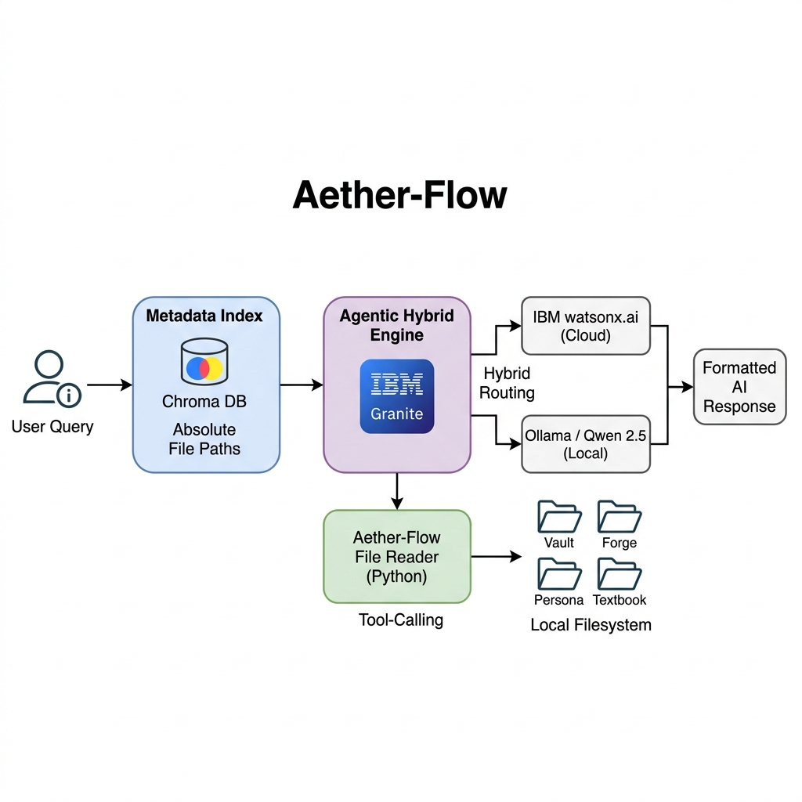

# Aether-Flow: Hybrid Agentic RAG Copilot with Direct File Access

## 🚀 Overview
**Domain:** Education  
**Core Concept:** Aether-Flow is an AI-powered Agentic Copilot designed for high-speed, zero-latency file retrieval using a hybrid processing engine.

### The "Map-to-Path" Strategy
Unlike traditional RAG systems that chunk and embed entire documents, Aether-Flow employs a unique indexing strategy. It maps only the absolute system paths of over **2,300 files** into a lightweight Knowledge Map, ensuring extreme precision and speed.

---

## 🛠 Problem Statement
Traditional RAG systems often struggle with:
*   **High Latency:** Processing massive local datasets takes too long.
*   **Context Loss:** Vector chunking often breaks strict formatting in technical manuals or complex code.
*   **Computational Overhead:** High hardware requirements for instant local guidance.

---

## ✨ Key Features & Novelty
*   **Zero-Latency Retrieval:** Bypasses traditional chunking to reduce wait times from minutes to seconds.
*   **Agentic Tool-Calling:** Leverages a custom **Aether-Flow File Reader** (Python-based) for direct OS-level file access.
*   **Dual-Core Hybrid Architecture:**
    *   **Online/Cloud:** Uses **IBM watsonx.ai**, **IBM Granite**, or Groq/Mixtral for high-speed inference.
    *   **Offline/Local:** Seamless failover to **Qwen 2.5 via Ollama** for private, air-gapped processing.
*   **Massive Scalability:** Successfully indexes 2,300+ files across four pillars: *Vault, Forge, Persona, and Textbook*.

---

## 🏗 Technical Stack
*   **Orchestration:** LangFlow (Visual workflow management)
*   **LLMs:**
    *   **Primary:** `ibm-granite-3-2-8b-instruct` (Reasoning & Tool-calling)
    *   **Local Failover:** Ollama (Qwen 2.5 Coder, Llama 3.2)
*   **Vector Database:** Chroma DB (Metadata & Knowledge Map storage)
*   **Enterprise Platform:** IBM watsonx.ai
*   **Infrastructure:** IBM Cloud

---

## 🔄 System Architecture & Workflow
1.  **Chat Input:** User submits a query regarding code or documentation.
2.  **Metadata Retrieval:** System queries Chroma DB to find relevant absolute Windows file paths.
3.  **Tool-Calling Agent:** The IBM Granite agent analyzes the path and triggers the file reader.
4.  **Aether-Flow File Reader:** A custom Python component executes a direct OS-level read.
5.  **Context Synthesis:** The agent processes the raw content and provides a formatted, accurate response.

---

## 🔮 Future Scope
*   **Bi-Directional IDE Integration:** Transitioning from read-only to write permissions for autonomous code refactoring in VS Code.
*   **Real-Time Monitoring:** A "Watchdog" service to update the Knowledge Map instantly as files change.
*   **Intelligent Auto-Routing:** Automatic switching between Cloud and Local models based on network quality and query complexity.

---

## 📋 Submission Checklist
Ensure the following files are present in the repository:
- [ ] `app.json` (LangFlow flow file)
- [ ] `yourproblemstatement.pdf`
- [ ] `yourprojectpresentation.pptx`
- [x] `README.md` (Updated)
